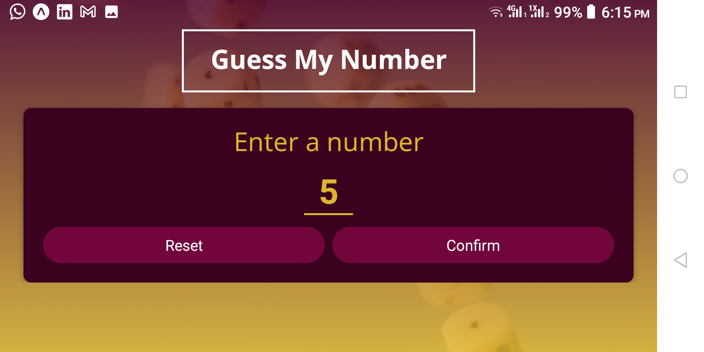

# RNGame

A game app to learn react-native

## Screenshots





## Learnings

1. How to use Expo and expo packages.
2. Deferences between Android and IOS when it comes to styling.
3. How to make the app responsive to different screen sizes and orientation and to different mobile platforms.

## Command-Line commands

```sh
yarn expo install expo-linear-gradient
yarn expo install expo-font
# yarn expo install expo-app-loading #deprecated
yarn expo install expo-splash-screen

# To eject to barebuild
yarn expo prebuild
```
